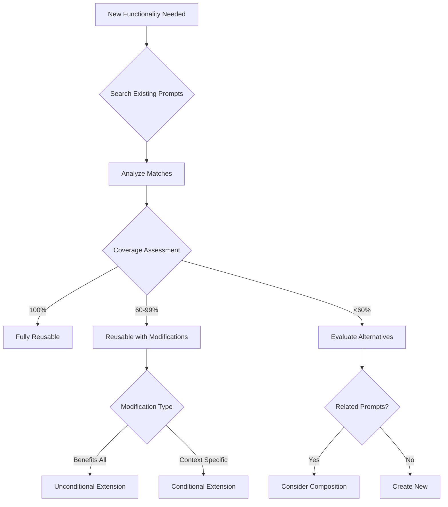

# Process: Determine Prompt Reusability

This process guides the systematic evaluation of existing prompts to determine if they can be reused for new functionality, and if so, how they should be integrated or extended.

## Process Overview



## Step 1: Define Functionality Requirements

Before searching, clearly define:

### Core Requirements
- **Primary purpose**: What must this functionality accomplish?
- **Key features**: List all essential capabilities
- **Input/Output**: What information flows through this functionality?
- **Integration points**: What other systems/processes will this interact with?

### Quality Attributes
- Performance requirements
- Error handling needs
- User experience expectations
- Security considerations

### Document the Requirements
```yaml
functionality: "Create standardized git commits"
features:
  - Generate conventional commit format
  - Validate commit message
  - Add ticket references
  - Include emoji prefixes (optional)
inputs:
  - Commit type
  - Scope (optional)
  - Description
  - Breaking change flag
outputs:
  - Formatted commit message
  - Git commit creation
```

## Step 2: Search Existing Prompts

### Search Strategy

1. **Direct Keyword Search**
   ```bash
   # Primary terms
   rg -i "commit|git|version" ~/.claude/
   
   # Secondary terms
   rg -i "conventional|standard|format" ~/.claude/
   ```

2. **Semantic Search**
   - Think of synonyms and related concepts
   - Consider different phrasings of the same functionality
   - Look for broader categories that might include your need

3. **Category Browsing**
   ```bash
   # List all process categories
   ls ~/.claude/processes/
   
   # List all patterns
   ls ~/.claude/patterns/
   ```

### Search Locations Priority
1. `processes/` - Standardized procedures
2. `patterns/` - Design and development patterns
3. `workflows/` - Multi-step processes
4. `templates/` - Reusable structures
5. `guides/` - How-to documentation

## Step 3: Analyze Prompt Coverage

For each potential match, create a coverage analysis:

### Coverage Matrix
```markdown
| Requirement | Prompt Provides | Coverage | Notes |
|-------------|----------------|----------|--------|
| Conventional format | ✅ Yes | 100% | Full support |
| Commit validation | ✅ Yes | 100% | Includes hooks |
| Ticket references | ✅ Yes | 100% | Jira/GitHub |
| Emoji prefixes | ❌ No | 0% | Not implemented |
| Git integration | ✅ Yes | 100% | Full git CLI |
| **Overall** | - | **80%** | Missing emoji only |
```

### Coverage Calculation
- Count features provided vs required
- Weight by importance (critical vs nice-to-have)
- Consider partial matches (provides similar but not exact)

## Step 4: Reusability Classification

### Fully Reusable (100% Coverage)
The prompt completely satisfies all requirements without modification.

**Indicators:**
- All features present
- Compatible interfaces
- No conflicting behaviors
- Performance meets needs

**Action:** Use as-is with proper documentation

### Reusable with Modifications (60-99% Coverage)
The prompt provides most functionality but needs enhancements.

**Indicators:**
- Core functionality matches
- Missing non-critical features
- Minor interface adjustments needed
- Generally compatible approach

**Action:** Proceed to modification analysis

### Limited Reusability (<60% Coverage)
The prompt provides some relevant functionality but significant gaps exist.

**Indicators:**
- Only partial feature overlap
- Major interface incompatibilities
- Different architectural approach
- Would require substantial changes

**Action:** Consider alternatives or composition

## Step 5: Modification Analysis

When a prompt needs modifications, determine the appropriate approach:

### Decision Criteria

#### Use Unconditional Extension When:
1. **Universal Benefit**: The feature improves the prompt for all users
2. **No Breaking Changes**: Existing users won't be negatively impacted
3. **Natural Evolution**: The feature feels like a natural part of the prompt
4. **Broad Applicability**: Multiple commands would benefit

**Example:**
```yaml
# Adding commit message length validation
extends: commit-standards.md
modification:
  type: unconditional
  rationale: "All users benefit from length validation"
  implementation: "Add validation step after message generation"
```

#### Use Conditional Extension When:
1. **Specific Use Case**: Only certain contexts need this feature
2. **Performance Impact**: The feature has costs not all users should bear
3. **Alternative Behaviors**: Different users need different behaviors
4. **Optional Enhancement**: Nice-to-have but not essential

**Example:**
```yaml
# Adding emoji prefixes
extends: commit-standards.md
modification:
  type: conditional
  condition: "config.use_emoji == true OR flag:--emoji"
  rationale: "Not all teams want emoji in commits"
  implementation: "Prepend emoji based on commit type when enabled"
```

### Modification Patterns

#### 1. Feature Addition
Adding new capabilities without changing existing behavior:
```markdown
## Extension: Emoji Support
When enabled, prepends type-appropriate emoji to commit messages:
- feat: ✨
- fix: 🐛
- docs: 📚
```

#### 2. Behavior Override
Replacing specific behaviors for certain conditions:
```markdown
## Override: Custom Format
When --format flag is provided, use custom template instead of conventional format
Default: "type(scope): description"
Override: User-provided format string
```

#### 3. Process Injection
Adding steps to existing workflow:
```markdown
## Injection: Pre-commit Hook
Before: Generate message → Create commit
After: Generate message → Run validation → Create commit
```

## Step 6: Document Reusability Decision

### Reusability Report Template
```markdown
## Prompt Reusability Analysis

### Evaluated Prompt
- Path: processes/version-control/commit-standards.md
- Version: 1.2.0
- Purpose: Standardized commit message creation

### Requirements Coverage
- Total Requirements: 5
- Covered: 4 (80%)
- Missing: Emoji prefix support

### Reusability Classification
✅ Reusable with Modifications

### Modification Approach
- Type: Conditional Extension
- Condition: --emoji flag or config setting
- Rationale: Team-specific preference
- Impact: No effect on existing users

### Implementation Plan
1. Extend commit-standards.md with emoji mapping
2. Add configuration check for emoji preference
3. Document the extension in command metadata
4. Test with and without emoji enabled

### Alternatives Considered
- Creating separate emoji-commits.md: Rejected (too much duplication)
- Unconditional addition: Rejected (not universally wanted)
- Using different base: Rejected (commit-standards is ideal match)
```

## Step 7: Composition Strategies

When single prompts don't provide enough coverage, consider composition:

### Sequential Composition
Chain multiple prompts in sequence:
```yaml
composition:
  - validate-input.md     # First validate
  - commit-standards.md   # Then format
  - git-operations.md     # Finally execute
```

### Parallel Composition
Use multiple prompts for different aspects:
```yaml
composition:
  parallel:
    - commit-message: commit-standards.md
    - validation: quality-checks.md
    - integration: git-operations.md
```

### Hybrid Composition
Mix reused and custom components:
```yaml
composition:
  - reused: input-validation.md
  - custom: emoji-selection
  - reused: commit-standards.md
  - custom: team-notifications
```

## Best Practices

### 1. Document Search Efforts
Record what you searched for and why you selected/rejected options:
```markdown
Searched: "git", "commit", "message", "conventional"
Found: 3 potential matches
Selected: commit-standards.md (80% coverage)
Rejected: git-workflow.md (too broad, 30% coverage)
```

### 2. Version Compatibility
Always specify version requirements:
```yaml
requires:
  commit-standards: ">=1.2.0"  # Needs ticket reference support
```

### 3. Test Integration
Before finalizing:
- Test with base prompt alone
- Test with your modifications
- Test edge cases
- Verify no regressions

### 4. Monitor Evolution
- Track when base prompts update
- Re-evaluate modifications periodically
- Consider upstreaming popular extensions

## Common Pitfalls

### 1. Over-Eager Reuse
❌ Forcing a 40% match to work
✅ Creating new when match is poor

### 2. Under-Specified Conditions
❌ "Sometimes use emoji"
✅ "Use emoji when config.emoji=true OR --emoji flag"

### 3. Hidden Dependencies
❌ Assuming prompt internals
✅ Using only documented interfaces

### 4. Modification Cascades
❌ One change requiring many others
✅ Self-contained modifications

## Success Metrics

A successful reusability analysis should:
- Take less time than creating from scratch
- Result in higher quality than custom implementation
- Maintain compatibility with prompt updates
- Clearly document all decisions
- Enable future reuse by others

---

Remember: The goal is to build on proven solutions while maintaining flexibility for specific needs. When in doubt, favor reusability with clear documentation over custom implementations.