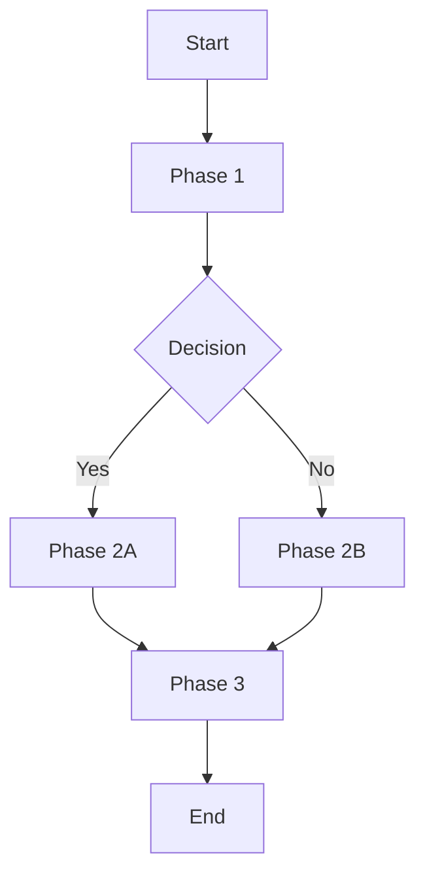

# New Workflow Request: ${WORKFLOW_NAME}

## Workflow Purpose
[What complex, multi-step process does this workflow orchestrate?]

## Workflow Overview

## Workflow Phases

### Phase 1: [Name]
**Duration**: [Estimated time]
**Purpose**: [What this phase accomplishes]
**Steps**:
1. [Step 1]
2. [Step 2]
3. [Step 3]

### Phase 2: [Name]
**Duration**: [Estimated time]
**Purpose**: [What this phase accomplishes]
**Steps**:
1. [Step 1]
2. [Step 2]

### Phase 3: [Name]
**Duration**: [Estimated time]
**Purpose**: [What this phase accomplishes]
**Steps**:
1. [Step 1]
2. [Step 2]

## Roles & Responsibilities
- **Role 1**: [What they do in the workflow]
- **Role 2**: [Their responsibilities]
- **System**: [Automated parts]

## Decision Criteria
### Decision Point 1
- **Question**: [What needs to be decided?]
- **Criteria**: [How to decide]
- **Impact**: [How this affects the flow]

## Dependencies
- **External Systems**: [What systems are involved]
- **Processes**: [What processes this workflow uses]
- **Data Requirements**: [What data is needed]

## Success Metrics
- **Time to Complete**: [Target duration]
- **Quality Metrics**: [How to measure success]
- **User Satisfaction**: [How to gauge]

## Automation Opportunities
- [What could be automated]
- [Current manual steps that could be improved]

## Task Context
[What complex task were you doing that needs this workflow?]

## Similar Workflows
[Are there similar workflows in other contexts?]

## Failure Recovery
[How to handle workflow failures or interruptions]