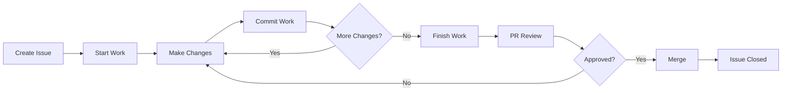

# Issue-Driven Development Workflow

## Purpose
Provides a complete, integrated workflow for development where every change is tracked from issue creation through PR merge, ensuring traceability, quality, and proper issue resolution.

## Overview
This workflow enforces that:
1. All work begins with an issue
2. Issues define scope and completion criteria
3. Branches are linked to issues
4. Commits are atomic and reference issues
5. PRs properly close issues when merged

## Workflow Stages



## Stage 1: Issue Creation

### Creating an Issue
```bash
# Use GitHub web interface or CLI
gh issue create \
  --title "Add user authentication" \
  --body "$(cat <<EOF
## Description
Implement user authentication system with email/password login

## Acceptance Criteria
- [ ] User can register with email/password
- [ ] User can login with credentials
- [ ] Session persists across browser refresh
- [ ] Password is securely hashed
- [ ] Tests cover all auth flows

## Technical Notes
- Use bcrypt for password hashing
- JWT for session management
EOF
)"
```

### Issue Requirements
Every issue MUST include:
- Clear description of work
- Acceptance criteria checklist
- Definition of Done
- Appropriate labels
- Milestone (if applicable)

## Stage 2: Starting Work

### Use the Automation Script
```bash
# Start work on issue #123
./scripts/workflow/start-work.sh 123

# This will:
# 1. Fetch issue details
# 2. Create appropriately named branch
# 3. Set up work tracking
# 4. Push branch to remote
```

### Manual Process
```bash
# 1. Create branch with issue number
git checkout -b feat/123-user-authentication

# 2. Push to track remotely
git push -u origin feat/123-user-authentication

# 3. Assign issue to self
gh issue edit 123 --add-assignee @me
```

## Stage 3: Development

### Making Changes
Follow these principles:
1. **Atomic Commits**: Each commit is one logical change
2. **Issue References**: Every commit references the issue
3. **Working State**: Code works after each commit
4. **Test Coverage**: Tests included with changes

### Using Commit Helper
```bash
# Stage changes
git add -p  # Interactive staging for atomic commits

# Create commit with validation
./scripts/workflow/commit-work.sh \
  -m "Add password hashing utility" \
  -t feat \
  -s auth

# For the final commit that completes the issue
./scripts/workflow/commit-work.sh \
  -m "Complete user authentication flow" \
  -t feat \
  -s auth \
  --fixes
```

### Manual Commit Process
```bash
# Work-in-progress commits
git commit -m "feat(auth): add password hashing utility

Related to #123"

# Final commit that closes the issue
git commit -m "feat(auth): complete authentication flow

Implements all acceptance criteria for user authentication.

Fixes #123"
```

## Stage 4: Creating Pull Request

### Use the Automation Script
```bash
# Create PR when work is complete
./scripts/workflow/finish-work.sh

# This will:
# 1. Verify commits reference issue
# 2. Check for "Fixes #N" 
# 3. Generate PR description
# 4. Create PR linking issues
```

### Manual PR Creation
```bash
gh pr create \
  --title "feat: Add user authentication system" \
  --body "## Summary
Implements user authentication with email/password login.

## Changes
- User registration endpoint
- Login/logout functionality
- Session management with JWT
- Password hashing with bcrypt

## Testing
- Unit tests for auth service
- Integration tests for auth flow
- Manual testing completed

Fixes #123

## Checklist
- [x] Tests pass
- [x] Documentation updated
- [x] No debug code
- [x] Follows code standards"
```

## Stage 5: Review Process

### For Reviewers
Follow the PR review checklist:
1. Verify issue requirements are met
2. Check all acceptance criteria
3. Ensure proper issue closure
4. Validate code quality
5. Confirm tests coverage

### For Authors
- Respond to feedback promptly
- Make requested changes in new commits
- Reference issue in fix commits
- Update PR description if scope changes

## Stage 6: Merging

### Pre-Merge Verification
- [ ] All reviews approved
- [ ] CI/CD passes
- [ ] Issue will be properly closed
- [ ] No merge conflicts
- [ ] Branch up-to-date

### Merge Process
```bash
# Squash merge for feature branches
gh pr merge --squash

# Rebase merge for clean history
gh pr merge --rebase

# The issue will automatically close due to "Fixes #123"
```

## Complete Example Workflow

```bash
# 1. Create issue
gh issue create --title "Add user profile page" --body "..."
# Returns: Created issue #124

# 2. Start work
./scripts/workflow/start-work.sh 124
# Creates: feat/124-add-user-profile-page

# 3. Make atomic commits
vim src/components/UserProfile.js
./scripts/workflow/commit-work.sh -m "Add UserProfile component structure" -t feat -s ui

vim src/api/profile.js  
./scripts/workflow/commit-work.sh -m "Add profile API endpoints" -t feat -s api

vim tests/UserProfile.test.js
./scripts/workflow/commit-work.sh -m "Add UserProfile component tests" -t test

vim src/pages/profile.js
./scripts/workflow/commit-work.sh -m "Complete profile page implementation" -t feat --fixes

# 4. Create PR
./scripts/workflow/finish-work.sh

# 5. After review and approval
gh pr merge --squash
```

## Handling Special Cases

### Child Issues
```bash
# Working on child issue #125 under parent #124
./scripts/workflow/start-work.sh 125 --parent 124
# Creates: feat/124-125-oauth-integration

# Commits reference both
git commit -m "feat(auth): add OAuth provider base class

Related to #125 (child of #124)"
```

### Multiple Issue PR
```bash
# PR that closes multiple issues
git commit -m "feat(auth): add social login support

Implements OAuth for Google, GitHub, and Facebook.

Fixes #124
Fixes #125  
Fixes #126
Related to #123"
```

### Hotfixes
```bash
# Expedited process for critical fixes
./scripts/workflow/start-work.sh 200 --type hotfix
# Creates: hotfix/200-security-patch

# Single atomic commit often sufficient
git commit -m "fix(security): patch authentication bypass

Fixes #200"

# Fast-track PR
./scripts/workflow/finish-work.sh --draft false
```

## Benefits

1. **Complete Traceability**: Every change linked to requirements
2. **Automated Workflows**: Scripts handle repetitive tasks
3. **Quality Gates**: Multiple validation points
4. **Clear History**: Atomic commits tell the story
5. **Automatic Closure**: Issues close when work merges

## Troubleshooting

### Common Issues

#### Forgot Issue Reference
```bash
# Amend last commit
git commit --amend -m "Original message

Related to #123"
```

#### No Fixes in Commits
```bash
# Add final commit
git commit --allow-empty -m "fix: complete implementation

Fixes #123"
```

#### Wrong Branch Name
```bash
# Rename local and remote
git branch -m old-name feat/123-correct-name
git push origin --delete old-name
git push -u origin feat/123-correct-name
```

## Integration Points
- Uses: GitHub operations router for API calls
- Uses: Git operations patterns for branching
- Follows: Commit standards process
- Implements: Issue tracking best practices
- Enables: PR review process

---
*This workflow ensures every change is purposeful, tracked, and properly implemented.*