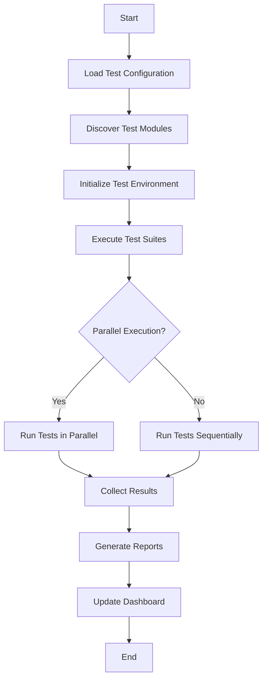

# Module Test Runner
## Automated Testing Framework for Claude Modules

---

## Overview
The test runner executes all module tests and generates comprehensive reports.

## Usage
```bash
# Run all tests
!test-modules

# Run specific test suite
!test-modules --suite validation

# Run tests for specific module
!test-modules --module ModuleName

# Run with verbose output
!test-modules --verbose
```

## Test Execution Flow



## Test Runner Implementation

```python
#!/usr/bin/env python3
# test_runner.py

import os
import sys
import json
import yaml
import time
import argparse
import subprocess
from datetime import datetime
from pathlib import Path
from typing import Dict, List, Tuple
from concurrent.futures import ThreadPoolExecutor, as_completed

class ModuleTestRunner:
    def __init__(self, config_path: str = ".claude/tests/test-config.yaml"):
        self.config = self.load_config(config_path)
        self.results = []
        self.start_time = None
        self.end_time = None
        
    def load_config(self, config_path: str) -> dict:
        """Load test configuration"""
        with open(config_path, 'r') as f:
            return yaml.safe_load(f)
    
    def discover_modules(self, path: str = ".claude") -> List[str]:
        """Discover all modules to test"""
        modules = []
        for root, dirs, files in os.walk(path):
            for file in files:
                if file.endswith(('.md', '.yaml', '.yml')):
                    if not any(skip in root for skip in ['tests', 'archive', 'cache']):
                        modules.append(os.path.join(root, file))
        return modules
    
    def run_test_suite(self, suite_name: str, module_path: str) -> Dict:
        """Run a specific test suite on a module"""
        suite = next(s for s in self.config['test_suites'] if s['name'] == suite_name)
        results = {
            'suite': suite_name,
            'module': module_path,
            'tests': [],
            'passed': 0,
            'failed': 0,
            'skipped': 0
        }
        
        for test_id in suite['tests']:
            result = self.run_single_test(test_id, module_path)
            results['tests'].append(result)
            
            if result['status'] == 'passed':
                results['passed'] += 1
            elif result['status'] == 'failed':
                results['failed'] += 1
            else:
                results['skipped'] += 1
        
        results['success'] = results['failed'] == 0
        return results
    
    def run_single_test(self, test_id: str, module_path: str) -> Dict:
        """Execute a single test"""
        start = time.time()
        
        try:
            # Execute test script
            cmd = f".claude/tests/module-tests/{test_id}.sh {module_path}"
            result = subprocess.run(
                cmd, 
                shell=True, 
                capture_output=True, 
                text=True,
                timeout=self.config.get('timeout', 30)
            )
            
            status = 'passed' if result.returncode == 0 else 'failed'
            output = result.stdout
            error = result.stderr
            
        except subprocess.TimeoutExpired:
            status = 'timeout'
            output = ''
            error = f'Test timed out after {self.config["timeout"]}s'
        except Exception as e:
            status = 'error'
            output = ''
            error = str(e)
        
        duration = time.time() - start
        
        return {
            'test_id': test_id,
            'status': status,
            'duration': duration,
            'output': output,
            'error': error
        }
    
    def run_all_tests(self, modules: List[str], parallel: bool = True) -> None:
        """Run all tests on all modules"""
        self.start_time = datetime.now()
        
        if parallel and self.config.get('parallel', True):
            self._run_parallel(modules)
        else:
            self._run_sequential(modules)
        
        self.end_time = datetime.now()
    
    def _run_parallel(self, modules: List[str]) -> None:
        """Run tests in parallel"""
        max_workers = self.config.get('max_workers', 4)
        
        with ThreadPoolExecutor(max_workers=max_workers) as executor:
            futures = []
            
            for module in modules:
                for suite in self.config['test_suites']:
                    if suite.get('required', True):
                        future = executor.submit(
                            self.run_test_suite, 
                            suite['name'], 
                            module
                        )
                        futures.append(future)
            
            for future in as_completed(futures):
                result = future.result()
                self.results.append(result)
                self._print_progress(result)
    
    def _run_sequential(self, modules: List[str]) -> None:
        """Run tests sequentially"""
        for module in modules:
            for suite in self.config['test_suites']:
                if suite.get('required', True):
                    result = self.run_test_suite(suite['name'], module)
                    self.results.append(result)
                    self._print_progress(result)
    
    def _print_progress(self, result: Dict) -> None:
        """Print test progress"""
        module_name = os.path.basename(result['module'])
        status = "✅" if result['success'] else "❌"
        print(f"{status} {module_name} - {result['suite']}: "
              f"{result['passed']} passed, {result['failed']} failed")
    
    def generate_report(self) -> None:
        """Generate test report"""
        report = {
            'test_run': {
                'start_time': self.start_time.isoformat(),
                'end_time': self.end_time.isoformat(),
                'duration': (self.end_time - self.start_time).total_seconds(),
                'total_modules': len(set(r['module'] for r in self.results)),
                'total_tests': sum(len(r['tests']) for r in self.results),
                'total_passed': sum(r['passed'] for r in self.results),
                'total_failed': sum(r['failed'] for r in self.results),
                'total_skipped': sum(r['skipped'] for r in self.results)
            },
            'results': self.results
        }
        
        # Save JSON report
        report_dir = Path(self.config['reporting']['output'])
        report_dir.mkdir(parents=True, exist_ok=True)
        
        timestamp = datetime.now().strftime('%Y%m%d_%H%M%S')
        report_path = report_dir / f'test_report_{timestamp}.json'
        
        with open(report_path, 'w') as f:
            json.dump(report, f, indent=2)
        
        # Generate summary
        self._print_summary(report['test_run'])
        
        # Update dashboard
        self._update_dashboard(report)
    
    def _print_summary(self, summary: Dict) -> None:
        """Print test summary"""
        print("\n" + "="*60)
        print("TEST SUMMARY")
        print("="*60)
        print(f"Duration: {summary['duration']:.2f}s")
        print(f"Modules Tested: {summary['total_modules']}")
        print(f"Total Tests: {summary['total_tests']}")
        print(f"Passed: {summary['total_passed']} ✅")
        print(f"Failed: {summary['total_failed']} ❌")
        print(f"Skipped: {summary['total_skipped']} ⏭️")
        
        success_rate = (summary['total_passed'] / summary['total_tests'] * 100 
                       if summary['total_tests'] > 0 else 0)
        print(f"Success Rate: {success_rate:.1f}%")
        
        if summary['total_failed'] > 0:
            print("\n❌ TESTS FAILED - See report for details")
            sys.exit(1)
        else:
            print("\n✅ ALL TESTS PASSED")
    
    def _update_dashboard(self, report: Dict) -> None:
        """Update test dashboard"""
        dashboard_path = Path(".claude/tests/dashboard.md")
        
        content = f"""# Module Test Dashboard
Last Updated: {datetime.now().strftime('%Y-%m-%d %H:%M:%S')}

## Latest Test Run
- **Duration**: {report['test_run']['duration']:.2f}s
- **Modules**: {report['test_run']['total_modules']}
- **Tests**: {report['test_run']['total_tests']}
- **Success Rate**: {report['test_run']['total_passed'] / report['test_run']['total_tests'] * 100:.1f}%

## Test Results by Suite
"""
        
        # Group results by suite
        suites = {}
        for result in report['results']:
            suite = result['suite']
            if suite not in suites:
                suites[suite] = {'passed': 0, 'failed': 0, 'modules': 0}
            
            suites[suite]['modules'] += 1
            suites[suite]['passed'] += result['passed']
            suites[suite]['failed'] += result['failed']
        
        for suite, stats in suites.items():
            total = stats['passed'] + stats['failed']
            rate = stats['passed'] / total * 100 if total > 0 else 0
            content += f"\n### {suite.title()}\n"
            content += f"- Modules: {stats['modules']}\n"
            content += f"- Success Rate: {rate:.1f}%\n"
            content += f"- Passed: {stats['passed']} | Failed: {stats['failed']}\n"
        
        dashboard_path.write_text(content)


def main():
    parser = argparse.ArgumentParser(description='Run module tests')
    parser.add_argument('--suite', help='Run specific test suite')
    parser.add_argument('--module', help='Test specific module')
    parser.add_argument('--verbose', action='store_true', help='Verbose output')
    parser.add_argument('--sequential', action='store_true', help='Run tests sequentially')
    
    args = parser.parse_args()
    
    runner = ModuleTestRunner()
    
    # Discover modules
    modules = runner.discover_modules()
    if args.module:
        modules = [m for m in modules if args.module in m]
    
    print(f"🔍 Testing {len(modules)} modules...")
    
    # Run tests
    runner.run_all_tests(modules, parallel=not args.sequential)
    
    # Generate report
    runner.generate_report()


if __name__ == '__main__':
    main()
```

---

## Test Helpers

```bash
#!/bin/bash
# test_helpers.sh

# Source this file in test scripts for common functions

# Color codes
RED='\033[0;31m'
GREEN='\033[0;32m'
YELLOW='\033[1;33m'
NC='\033[0m' # No Color

# Test result tracking
TESTS_RUN=0
TESTS_PASSED=0
TESTS_FAILED=0

# Test functions
test_start() {
    local test_name=$1
    echo -e "${YELLOW}Running: ${test_name}${NC}"
    TESTS_RUN=$((TESTS_RUN + 1))
}

test_pass() {
    local test_name=$1
    echo -e "${GREEN}✅ PASS: ${test_name}${NC}"
    TESTS_PASSED=$((TESTS_PASSED + 1))
}

test_fail() {
    local test_name=$1
    local reason=$2
    echo -e "${RED}❌ FAIL: ${test_name}${NC}"
    echo -e "${RED}   Reason: ${reason}${NC}"
    TESTS_FAILED=$((TESTS_FAILED + 1))
}

test_skip() {
    local test_name=$1
    local reason=$2
    echo -e "${YELLOW}⏭️  SKIP: ${test_name} - ${reason}${NC}"
}

# Assertion helpers
assert_equals() {
    local expected=$1
    local actual=$2
    local message=${3:-"Values not equal"}
    
    if [ "$expected" != "$actual" ]; then
        test_fail "$message" "Expected: '$expected', Got: '$actual'"
        return 1
    fi
    return 0
}

assert_contains() {
    local haystack=$1
    local needle=$2
    local message=${3:-"String not found"}
    
    if ! echo "$haystack" | grep -q "$needle"; then
        test_fail "$message" "'$needle' not found in output"
        return 1
    fi
    return 0
}

assert_file_exists() {
    local file=$1
    local message=${2:-"File not found"}
    
    if [ ! -f "$file" ]; then
        test_fail "$message" "File does not exist: $file"
        return 1
    fi
    return 0
}

# Summary function
print_test_summary() {
    echo -e "\n${YELLOW}Test Summary:${NC}"
    echo -e "Tests Run: $TESTS_RUN"
    echo -e "Passed: ${GREEN}$TESTS_PASSED${NC}"
    echo -e "Failed: ${RED}$TESTS_FAILED${NC}"
    
    if [ $TESTS_FAILED -eq 0 ]; then
        echo -e "\n${GREEN}All tests passed!${NC}"
        return 0
    else
        echo -e "\n${RED}Some tests failed!${NC}"
        return 1
    fi
}
```

---

## Dashboard Template

```markdown
# Module Test Dashboard
Last Updated: [timestamp]

## Overall Health


## Latest Test Run
- **Duration**: X.Xs
- **Modules**: Y
- **Tests**: Z
- **Success Rate**: N%

## Trends
[Chart showing test success rate over time]

## Problem Areas
1. Module X - Failing dependency tests
2. Module Y - Size limit exceeded
3. Module Z - Missing test scenarios

## Recent Changes
- [timestamp] Fixed circular dependency in ModuleA
- [timestamp] Added test scenarios to ModuleB
- [timestamp] Reduced size of ModuleC
```